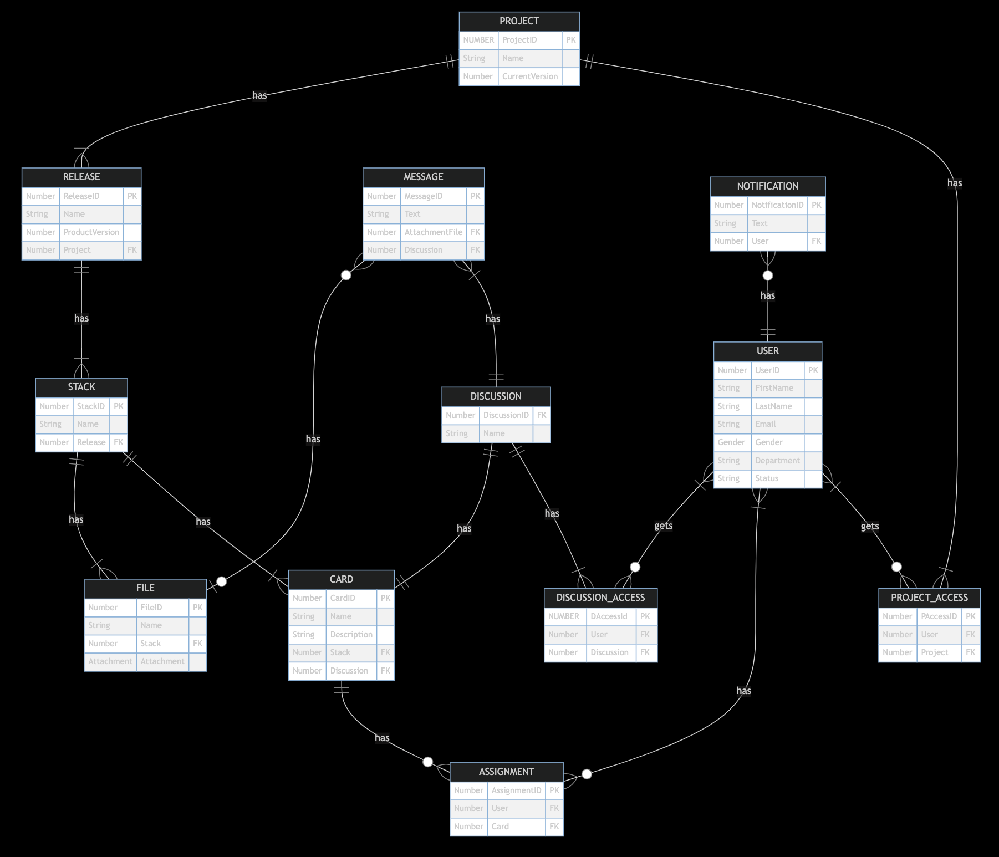
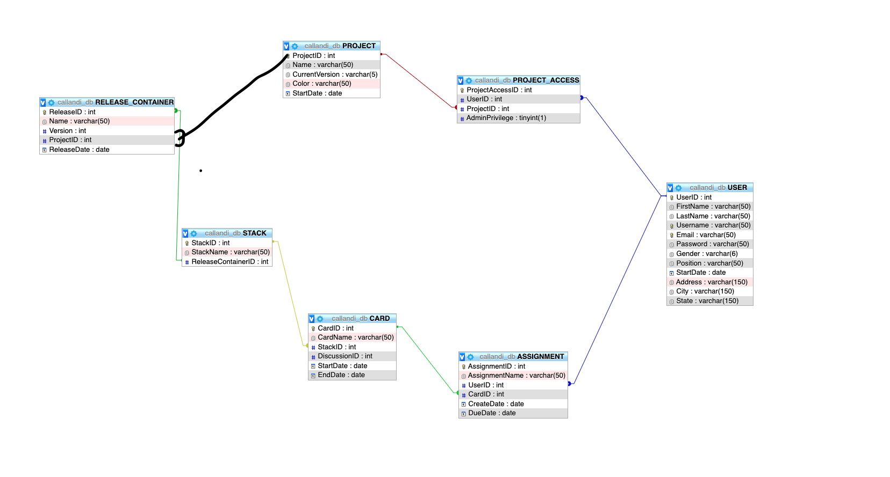
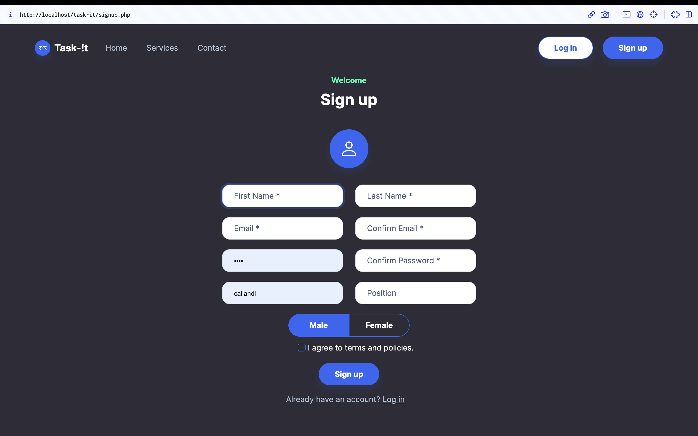
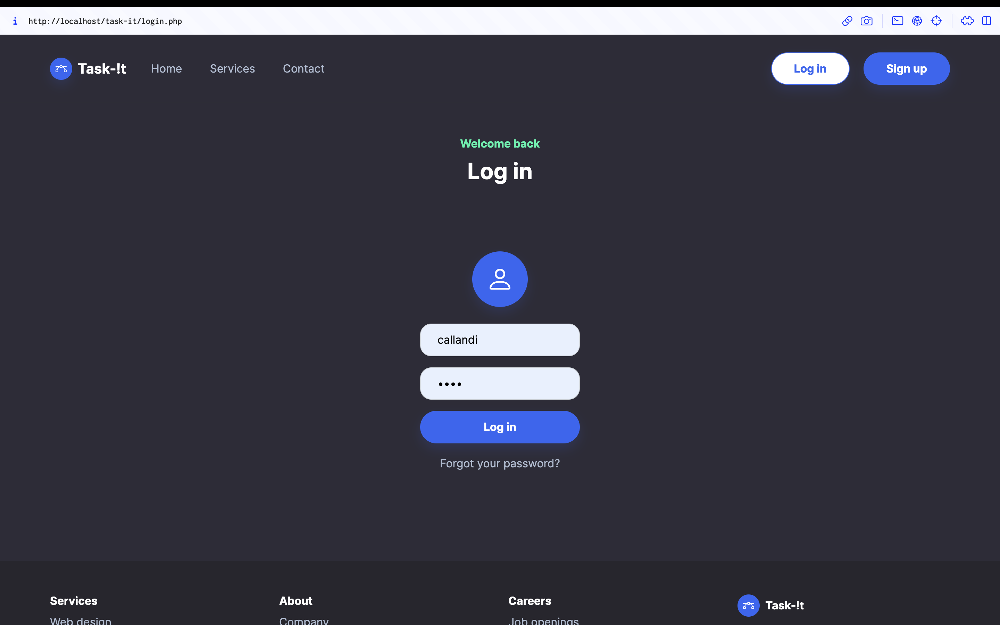
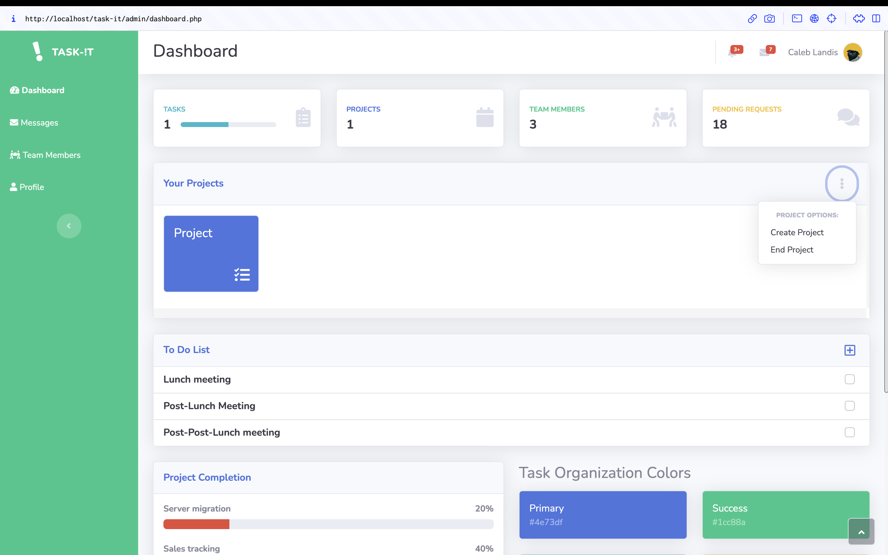
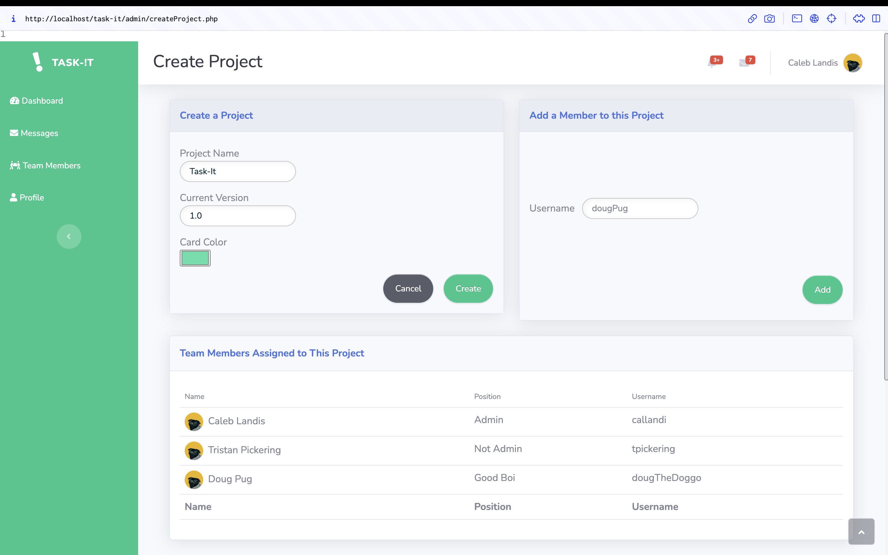
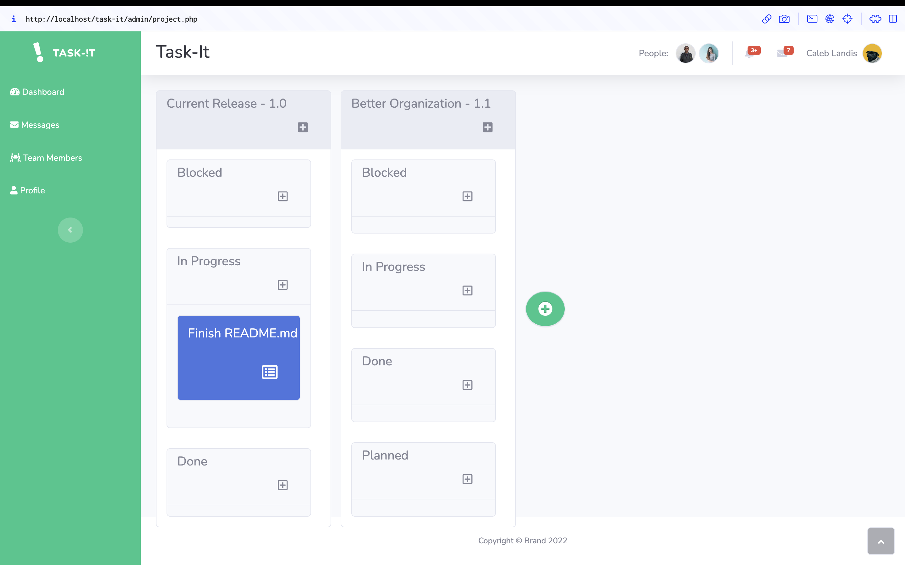
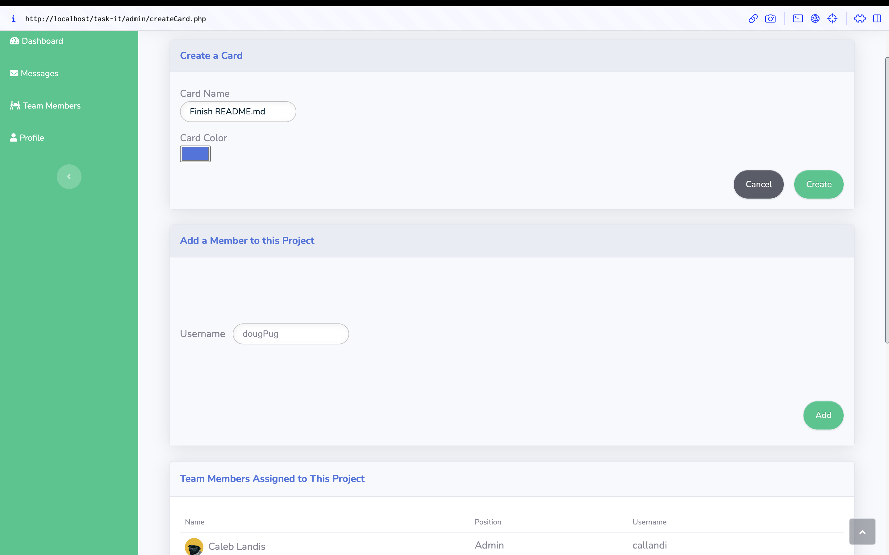
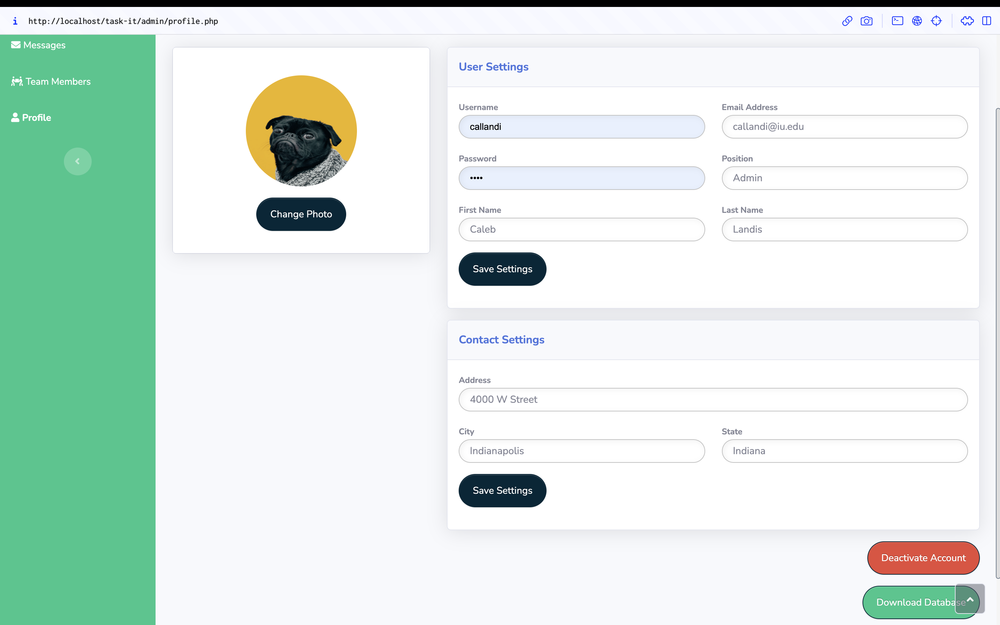

# **Task-!t**

_Task-!t_ is a full-stack web app made with PHP and MySQL designed for creating kanban boards. This application was created as a semester-long project for my _Server-Side Programming for the Web_ class at IUPUI. This class introduced me to many server-side programming concepts while using PHP such as connecting to a database, CRUD operations, form validation, and user sessions. We also learned how to create and manage databases using MySQL and phpMyAdmin while also studying sound database design,  normalization, and restriction techniques.

_Task-!t_ was designed to be a software project management system using the kanban board method. Users can create projects, where they can plan out current and future releases of their software. Each release starts with three stacks: _Blocked, In Progress,_ and _Done_. Stacks are where task cards are found, with each stack signifying the status of that task.

## Running the Application
Currently the application can only be run on a local web server. I personally use [XAMPP](https://www.apachefriends.org/index.html) because it automatically installs PHP and MySQL. Therefore, I will continue my installation instructions based on using XAMPP:

1. Install XAMPP
2. Using the XAMPP control panel, make sure the web server and MySQL database are running.
3. In the XAMPP application folder, navigate to the "htdocs" directory.
4. Create a folder for the project called “task-it”.
5. Pull the project files from Github into this directory.
6. Open your web browser and navigate to  “http://localhost/phpmyadmin”.
7. Create a database called “task_it’.
8. Import the “init_DB.sql” file into this database.
9. Create a new tab in your web browser and navigate to “http://localhost/Task-It/“.
10. Click the "Sign up" button at the top right corner to create an account and use the application.

## Using the Application
Most of the web application has a lot of fluff design for how the service would work if it were to continue to be built. For example the messages, team members, to-do list, project completion percentages, and notification features are all unimplemented, but they are designed for how they could look. My initial database design is shown below, followed by what tables were actually created and used.

### Initial Database Design

### Current Database Design

### Sign Up and Log In
The landing page also has a lot of fluff design, but the sign up and login pages are fully functional. To use the application, complete the sign up form to create a user account. Then go to the log in page and fill out that form.

### Dashboard
The dashboard is where users can create, view, and end projects. Click the three dots in the "Your Projects" section to either create a project or end one.

When creating a project, you can add other users to the project so they can view and add tasks.

### Project 
After clicking on a project from the dashboard, users will see the project view page. This page is where you can create releases, stacks, and task cards. Click the plus button for the corresponding container you want to create. 

Much like projects, you can add users to specific tasks when creating task cards. This helps you keep track of who is assigned to certain tasks. Doug Pug gets assigned to every project and task becasue he's a very good boy. :)

### Profile
The profile page is where users can view and edit their account information. Users can change most of their user and contact settings, but they currently can't change their profile photo. Users can also deactivate their account from this page. Admins can also download all of the database information from this page.

